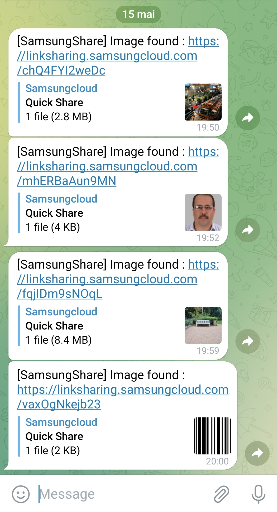

<p align="center">

</p>
<h1 align="center">Samsung-share-osint</h1>
<p align="center">
  
  
  
</p>

<b align="center">Brute force the token hash used by Samsung share to find random images of people</b>

**`Installation`**
```
git clone https://github.com/Lucstay11/Samsung-share-osint
cd Samsung-share-osint
chmod +x config.sh samsung-share.sh
``` 
<b align="center">Before launching the script enter the coordinates of your telegram bot in config.sh</b>

**`Run`**

```
bash samsung-share.sh
```

<b align="center">Preferably, put your script in a crontab to run it in the background at startup</b>

```
crontab -e
@reboot /$HOME/Samsung-share-osint/samsung-share.sh
```
